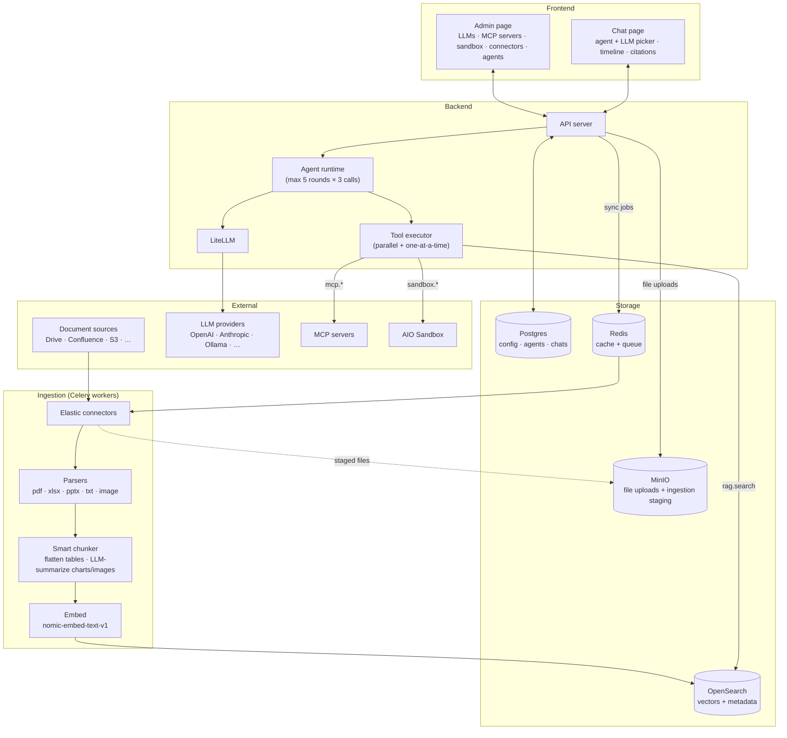
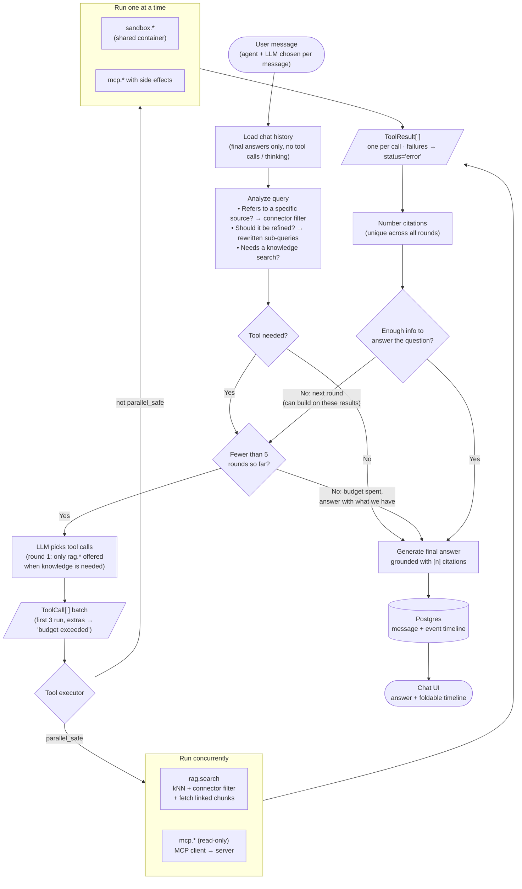

# rag-me-not

A lightweight, self-hostable **AI agent builder**. You connect your documents, LLMs, MCP tools and a code sandbox, then build agents out of them and chat with those agents. Any answer that uses your documents comes with citations.

It takes the core ideas of [Onyx](https://github.com/onyx-dot-app/onyx) and [AnythingLLM](https://github.com/Mintplex-Labs/anything-llm) and cuts them down to a codebase small enough to read in an afternoon. Built as an AI capstone project.

> **Status:** 🚧 design / early development

---

## What it does

- **Ingest documents** from external sources (via Elastic connectors), parse PDF / XLSX / PPTX / text / images, and chunk them smartly. Tables are flattened, and charts and images are summarized by an LLM.
- **Configure any LLM** (OpenAI, Anthropic, Ollama, …) through LiteLLM.
- **Give agents tools:**
  - **RAG**: semantic search over OpenSearch, limited to the connectors the agent is allowed to search
  - **MCP actions**: connect to any MCP server
  - **AIO Sandbox**: an isolated environment where the agent can run code, use a shell and browse
- **Build multiple agents** from the admin page. Each one combines an instruction prompt, a set of tools and the connectors its RAG tool can search.
- **Chat** with any agent and pick a different LLM for each message. Every step the agent takes shows up in a foldable timeline.

---

## Architecture



---

## Agent loop

The loop works in **rounds**. In each round the LLM can ask for several tool calls at once (a batch). Independent calls run in parallel, and anything that needs an earlier result waits for a later round.



**Rules the loop follows**

1. **Plan first.** Before touching any tool, the agent asks itself whether the query refers to a specific source (connector), whether the query should be rewritten, and whether it needs to search the knowledge base at all.
2. **RAG first, enforced in code.** When the analysis says knowledge is needed, round 1 only offers `rag.*` tools to the LLM, so it cannot skip the vector DB. Searches only cover the connectors assigned to the agent. The analysis can narrow that to the connectors the query refers to, but never widen it. Any neighboring or parent chunks linked to a hit are pulled in too.
3. **Fall back to other tools.** From round 2 on, MCP actions and the sandbox are offered as well. They are used when RAG results are missing or irrelevant, or when the query needs an action and not a lookup.
4. **Batch independent calls.** The LLM can return several tool calls in one response, e.g. one `rag.search` per sub-query or per connector. A call that needs another call's result waits for the next round.
5. **Run in parallel only when it's safe.** Every tool declares `parallel_safe`. `rag.*` and read-only MCP tools run concurrently. `sandbox.*` (one shared container) and MCP tools with side effects run one at a time. A timeout or exception becomes a `status="error"` result, so one failure never breaks the batch. Every call ID always gets a result, because LLM providers reject the next request otherwise.
6. **Reflect after every round.** Once a batch finishes, the agent asks whether it has enough to answer. If not, it starts another round.
7. **Hard budget.** At most **5 rounds** and **3 calls per round**. Parallel calls take about as long as one, so rounds are what control latency. Calls beyond the per-round cap are not run and get a "budget exceeded" error result. When the rounds run out, the agent answers with what it has.
8. **Clean history.** Later turns only see earlier user messages and final answers. Tool calls and thinking are stored for the timeline but not fed back to the model.
9. **Always cite.** Every answer that uses RAG links back to its source chunks. The executor assigns citation numbers, not the individual tools, so two parallel searches never both produce a `[1]`.

Every step (analysis, tool batch, results, reflection) is emitted as an event. Events are streamed to the UI and saved to Postgres, and the chat timeline is built from them. Calls from the same round are grouped under one step.

---

## Standard tool-call format

Every tool, whether RAG, MCP or sandbox, uses the same contract. That lets the agent loop and the UI treat all of them the same way.

```python
@dataclass
class ToolCall:
    id: str
    tool: str                 # "rag.search" | "mcp.<server>.<tool>" | "sandbox.<action>"
    args: dict[str, Any]
    reason: str               # why the agent chose it (shown in the timeline)

@dataclass
class Citation:
    index: int                # the [n] used in the answer, unique across rounds
    chunk_id: str
    title: str
    url: str

@dataclass
class ToolResult:
    call_id: str
    status: Literal["ok", "error"]
    content: str              # what is fed back to the LLM
    citations: list[Citation] = field(default_factory=list)

class Tool(Protocol):
    name: str
    description: str
    parameters: dict          # JSON Schema, passed to LiteLLM as the tool definition
    parallel_safe: bool       # False for sandbox.* and MCP tools with side effects
    async def run(self, call: ToolCall) -> ToolResult: ...
```

Each round, the executor runs a batch like this:

```python
MAX_ROUNDS = 5
MAX_CALLS_PER_ROUND = 3
TOOL_TIMEOUT_S = 30

async def run_one(call: ToolCall) -> ToolResult:
    try:
        return await asyncio.wait_for(TOOLS[call.tool].run(call), TOOL_TIMEOUT_S)
    except Exception as e:                    # a failed call never breaks the batch
        return ToolResult(call.id, "error", f"{type(e).__name__}: {e}")

async def run_batch(calls: list[ToolCall]) -> list[ToolResult]:
    run, over = calls[:MAX_CALLS_PER_ROUND], calls[MAX_CALLS_PER_ROUND:]
    safe = [c for c in run if TOOLS[c.tool].parallel_safe]
    serial = [c for c in run if not TOOLS[c.tool].parallel_safe]

    async def in_order() -> list[ToolResult]:
        return [await run_one(c) for c in serial]

    parallel_results, serial_results = await asyncio.gather(
        asyncio.gather(*(run_one(c) for c in safe)),
        in_order(),
    )
    skipped = [ToolResult(c.id, "error", "budget exceeded: call not run") for c in over]
    return [*parallel_results, *serial_results, *skipped]   # one result per call ID
```

After each batch, the agent loop numbers the citations and adds one `role: "tool"` message per result before calling the LLM again.

---

## Ingestion pipeline

```
source ──► Elastic connector ──► MinIO (staging) ──► parser ──► smart chunker ──► embed ──► OpenSearch
```

- **Connectors**: Celery workers call the Elastic connectors data-source classes directly to list and download files. Elasticsearch is not used. Connector config, credentials and sync cursors live in Postgres.
- **Change detection**: each file's source version (S3 ETag, Drive modifiedTime) and sha256 are stored in Postgres, so unchanged files are skipped and files deleted at the source are removed from OpenSearch.
- **Storage**: MinIO holds chat uploads, files uploaded for `file` connectors, and a staging bucket for downloaded files whose objects expire after a day.
- **Parsers**: separate logic for PDF, XLSX, PPTX, plain text and images.
- **Smart chunking**: chunks follow the document's structure (headings, slides, sheets). Tables are flattened to text, and charts and images are replaced with LLM-written summaries. Each chunk is a dataclass that records its connector and document (for filtering and citations) and links to its neighbor and parent chunks (used to expand context at retrieval time).
- **Embeddings**: `nomic-embed-text-v1`. Its inputs need the task prefixes `search_document: ` when indexing and `search_query: ` when querying.
- **Chunk size**: still open. A reasonable starting point is ~512 tokens with ~10–15% overlap, tuned against a small eval set.

---

## Tech stack

| Layer          | Choice                                   |
| -------------- | ---------------------------------------- |
| Connectors     | [Elastic connectors](https://github.com/elastic/connectors) (data-source classes only, no Elasticsearch) |
| LLM gateway    | [LiteLLM](https://github.com/BerriAI/litellm) |
| Embeddings     | [nomic-embed-text-v1](https://huggingface.co/nomic-ai/nomic-embed-text-v1) |
| Vector DB      | OpenSearch (k-NN)                        |
| Tools          | MCP client · [AIO Sandbox](https://github.com/agent-infra/sandbox) |
| Database       | Postgres + SQLAlchemy + Alembic          |
| Object storage | [MinIO](https://github.com/minio/minio) (S3 API) |
| Cache / queue  | Redis                                    |
| Workers        | Celery                                   |
| Frontend       | Admin page + Chat page                   |

---

## Roadmap

- [ ] Postgres schema (LLMs, MCP servers, connectors, agents, chats) with Alembic migrations
- [ ] LLM configuration through LiteLLM
- [ ] Ingestion: connectors → parsers → smart chunker → OpenSearch
- [ ] RAG tool with per-agent connector filters, chunk expansion and citations
- [ ] MCP client and AIO Sandbox tools behind the standard tool contract
- [ ] Agent loop with planning, reflection, parallel tool batches and a 5-round × 3-call budget
- [ ] Admin page and chat page (agent/LLM picker, foldable timeline)

---

## Inspiration

[Onyx](https://github.com/onyx-dot-app/onyx) ·
[AnythingLLM](https://github.com/Mintplex-Labs/anything-llm) ·
[Cherry Studio](https://github.com/CherryHQ/cherry-studio) ·
[Manus](https://manus.im) ·
[OpenHands](https://github.com/All-Hands-AI/OpenHands) ·
[LibreChat](https://github.com/danny-avila/LibreChat)
